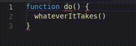

# Visual Studio Code extension bracket-changer [WIP]

## Features

This extension makes it easy to change the bracket arount a text. Right now (), {}, and [] will be changed in a circle.

(Note: Will be replaced with a better example later)

## Extension Settings

None so far.

## Release Notes

Will be added when there is a release.

